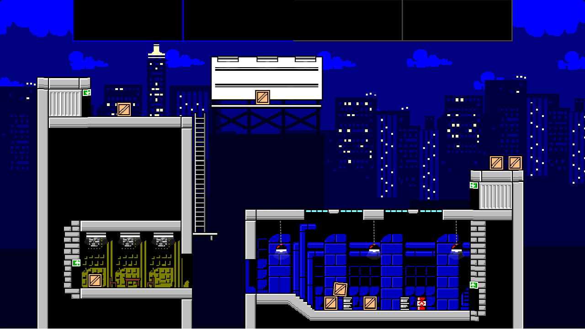
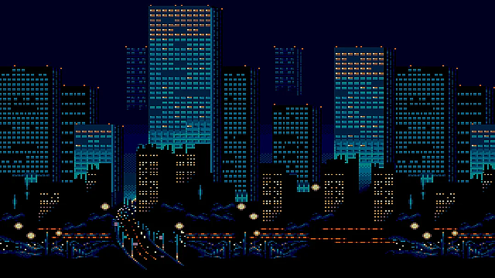
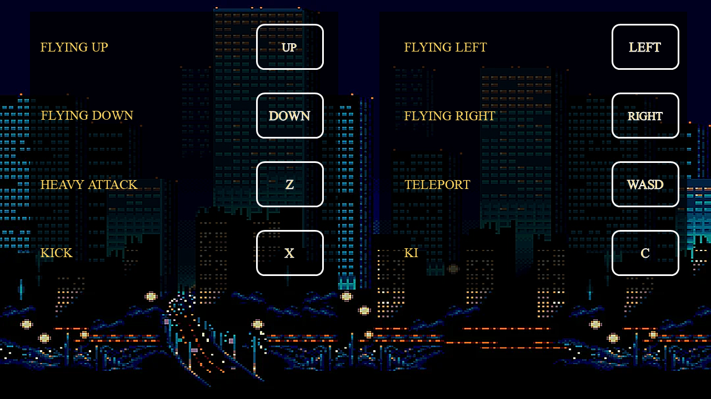

# Eternal Brawl
A game written from scratch in C++ using the SDL2 development library. Apart from the core gameplay, the project also includes some extra features like a simple main menu, music and sound effects, Enemy AI. All sprites were created not by me.

## Gallery
<!--  -->
<!---->


<!-- 
   -->

## Installation
If you just want to try the game on your PC, go to the [Releases](https://github.com/mthang1201/Game/releases) page and get the latest executable.
- You may need the [Microsoft Visual C++ Redistributables](https://support.microsoft.com/en-us/topic/the-latest-supported-visual-c-downloads-2647da03-1eea-4433-9aff-95f26a218cc0) if you don't have them already installed.

## Build Instructions
I built this C++ SDL2 Game project with Visual Studio 2022. However, to compile the game, you only need [SDL packages](https://cmake.org/download/) and [g++](https://www.mingw-w64.org/downloads/).

First of all, clone the repository to your Windows machine.
```
git clone https://github.com/mthang1201/Eternal-Brawl.git -b master
```
- Alternatively, you can install the zip file and extract it to a desired location.

Secondly, install SDL packages and g++(through MinGW). Remember to install MinGW using the installer, or you may need to add the environment variables manually.

Thirdly, extract SDL packages and create include and lib folders in the root directory.

Then move all files from SDL packages to these folders: header files to include folder, lib files to lib folder, dll files to Eternal-Brawl folder in the root directory.

You shoud have files tree like this:
```
```

Open a terminal window in the root directory of the cloned repository and run these command:
```
cd Eternal-Brawl
g++ *.cpp -o Eternal-Brawl -I../include -L../lib -lmingw32 -lSDL2main -lSDL2 -lSDL2_image -lSDL2_mixer
```

And, voila, you have successfully built the source. Check the Eternal-Brawl executable in the Eternal-Brawl directory.

## Controls
- Up/Down/Left/Right arrow keys: Move the character
- WASD: teleport
- Z: Heavy attack
- X: Kick
- C: Ki
- Esc: Pause the game
- Mouse click: Menu


## List of features
- Create sprites for all objects
- Create MenuState, PlayState, GameOverState, InstructionState
- Add background music, sound effects
- Check collision
- Handle movement, animation
- Interact between Player and Enemy
- Create health bar, agility bar
- Generate enemies

## Features to add
- Enemy move to player

## Third party tools
- [SDL 2.29.2](https://github.com/libsdl-org/SDL/releases/tag/prerelease-2.29.2) to handle all the low-level stuff
- [SDL_image 2.8.2](https://github.com/libsdl-org/SDL_image/releases/tag/release-2.8.2) for loading images
- [SDL_mixer 2.8.0](https://github.com/libsdl-org/SDL_mixer/releases/tag/release-2.8.0) for loading sounds

## Acknowledgements
[Lazy Foo's SDL tutorials](https://lazyfoo.net/tutorials/SDL/index.php) have been extremely helpful, look into them if you are interested in low-level game programming or just want a framework to handle basic graphics for your C/C++ programs.

[File structure and README.md layout example](https://github.com/mvlassis/pixeltetris)

[An Introduction to Modern CMake](https://www.willusher.io/sdl2%20tutorials/2014/03/06/lesson-0-cmake) is great for learning the basics of CMake and avoiding bad practices.

[Codergopher's tutorial](https://www.youtube.com/playlist?list=PL2RPjWnJduNmXHRYwdtublIPdlqocBoLS) was my initial inspiration for starting this project.

[SDL Game Development](https://books.google.com.vn/books/about/SDL_Game_Development.html?id=SbmfrHIlhK4C&source=kp_book_description&redir_esc=y) by Shaun Mitchell, 2013.

## License
- The source code is licensed under the [MIT License](https://tldrlegal.com/license/mit-license).
- Still working on...
<!-- - The Munro fonts are licensed under the [SIL Open Font License](http://scripts.sil.org/OFL). -->
